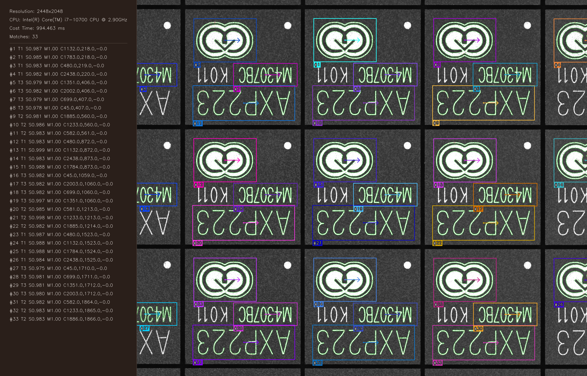
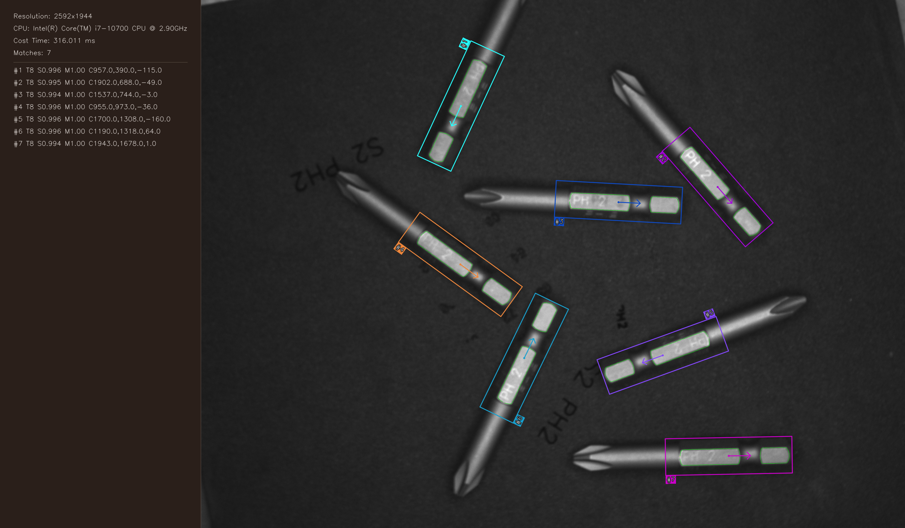
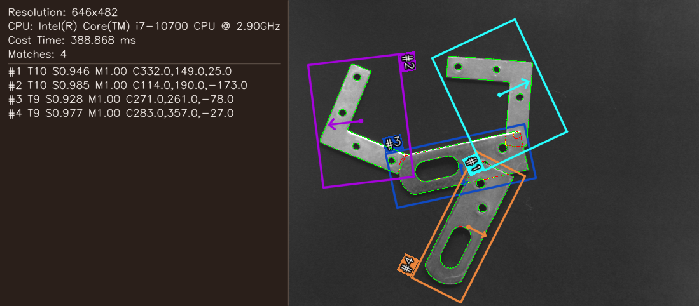
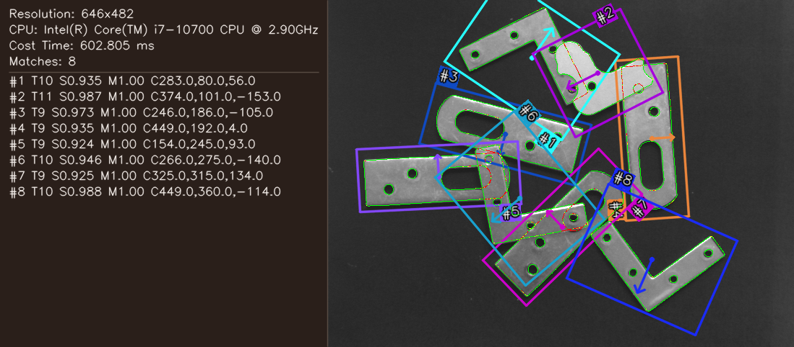
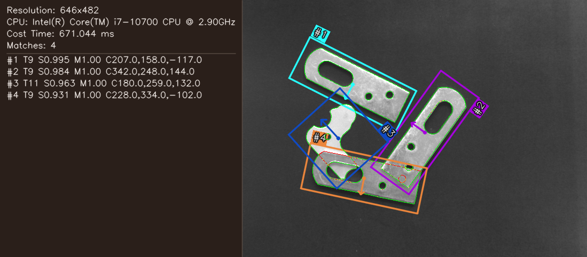

# edgeMatching

[](https://ubuntu.com/)[](https://www.microsoft.com/windows)[](https://isocpp.org/)[](https://cmake.org/)[](https://opencv.org/)[](https://www.qt.io/)[](LICENSE)

基于梯度方向余弦相似度的工业边缘形状模板匹配。项目包含 C++ 核心库、
`train`/`inference` 命令行程序，以及支持中英文的 Qt5 客户端。

## 效果展示与核心数学原理

### 1. 匹配效果展示

| 多模板并发匹配（`src1_2_3`） | 边界截断与部分可见（`src8`） |
| :---: | :---: |
|  |  |
| **同时匹配 3 种模板（共检出 33 个目标）** | **边界截断目标高精度检出（共检出 7 个目标）** |

| 局部极性反转（`src9_1`） | 密集排布与旋转定位（`src9_2`） | 弱对比度与杂乱背景（`src9_6`） |
| :---: | :---: | :---: |
|  |  |  |
| **`src9_1`：极性反转与光照变化** | **`src9_2`：多角度密集工件精准识别** | **`src9_6`：弱纹理背景下的稳定匹配** |

*(更多测试场景及可视化结果请参见 [docs/template_matching_algorithm.md](docs/template_matching_algorithm.md) 与 [assert 全量回归矩阵](#assert-全量回归矩阵))*

### 2. 核心数学公式说明

算法使用模板轮廓点的归一化梯度方向与待测图梯度方向之间的余弦相似度进行匹配：

1. **整体余弦相似度度量（Similarity）**：
   衡量变换后模板轮廓各特征点与待测图对应点之间方向的一致性：

   

   $$
   \text{Similarity} = \cos(\theta_i) = \frac{\sum_{i=1}^n (T_i \cdot S_i)}{\sqrt{\sum_{i=1}^n \|T_i\|^2} \cdot \sqrt{\sum_{i=1}^n \|S_i\|^2}}
   $$
   
   
2. **特征点单位梯度向量归一化（Normalized Gradient Vectors）**：
   消除局部光照绝对强度的影响，仅保留几何方向特征：

   

   $$
   \hat{T}_i = \frac{T_i}{\|T_i\|} = \left[ \frac{T_{i,x}}{\sqrt{T_{i,x}^2 + T_{i,y}^2}}, \frac{T_{i,y}}{\sqrt{T_{i,x}^2 + T_{i,y}^2}} \right], \quad \hat{S}_i = \frac{S_i}{\|S_i\|} = \left[ \frac{S_{i,x}}{\sqrt{S_{i,x}^2 + S_{i,y}^2}}, \frac{S_{i,y}}{\sqrt{S_{i,x}^2 + S_{i,y}^2}} \right]
   $$
   
   
3. **单点方向余弦 / 点积展开（Dot Product Expansion）**：
   二维梯度的内积分解为水平与垂直两个正交分量的乘积累加，支持 AVX2 SIMD 高度向量化加速：

   

   $$
   \cos(\theta_i) = \hat{T}_i \cdot \hat{S}_i = \left( \frac{T_{i,x}}{\sqrt{T_{i,x}^2 + T_{i,y}^2}} \cdot \frac{S_{i,x}}{\sqrt{S_{i,x}^2 + S_{i,y}^2}} \right) + \left( \frac{T_{i,y}}{\sqrt{T_{i,x}^2 + T_{i,y}^2}} \cdot \frac{S_{i,y}}{\sqrt{S_{i,x}^2 + S_{i,y}^2}} \right)
   $$
   

## 功能

- 多层金字塔、旋转、尺度和多模板搜索。
- Canny 像素级、Canny + 抛物线亚像素、Devernay 亚像素三种训练边缘后端。
- 亚像素位姿精修、部分可见目标、全局/局部极性忽略、轮廓支撑带 NMS。
- 可选 AVX2 SIMD；运行时检测 CPU，不支持时自动使用可移植标量实现。
- Qt 客户端提供训练/推理参数页、金字塔特征预览、结果图及中英文切换。

核心算法说明见 [docs/template_matching_algorithm.md](docs/template_matching_algorithm.md)，
Qt 专项说明见 [UI/README.md](UI/README.md)。

## 构建、验证与打包

按目标平台阅读独立 SOP，文档包含环境准备、依赖构建、项目编译、样例验证、运行、打包和安装步骤：

- [Linux SOP（Ubuntu 18.04+）](docs/linux_build_sop.md)
- [Windows SOP（Windows 10/11，MinGW-w64 / MSVC）](docs/windows_build_sop.md)

## CLI：训练模板

```text
build/train [template_image] [--id N]
            [--edge-method pixel|current|devernay]
            [--output FILE] [--pyramid-output FILE]
```

| 参数 | 默认值 | 说明 |
| --- | --- | --- |
| `template_image` | `../assert/m1.png` | 8 位灰度或彩色模板图；彩色图在核心内部转灰度。 |
| `--id N` | `1` | 正整数模板 ID。 |
| `--edge-method` | `current` | `pixel`：Canny 像素级；`current`：Canny + 抛物线亚像素；`devernay`：Devernay 亚像素。 |
| `--output FILE` | 可执行文件同级的 `<模板文件名>.json` | JSON 输出路径；扩展名由调用者指定。 |
| `--pyramid-output FILE` | 不保存 | 保存各层灰度图和 canonical 特征叠加预览。 |

CLI 当前未暴露的训练默认值为：金字塔层数 `-1`（自动）、角度 `-180..180°`、
步长 `1°`、Otsu 关闭、最小/最大对比度 `25/100`。Qt 训练页可以直接设置这些值。
模型只保存 canonical 特征，加载时按推理角度生成缓存。

示例：

```bash
build/train assert/m9_1.bmp --id 10 \
  --edge-method devernay \
  --output build/m9_1.json \
  --pyramid-output build/m9_1.pyramid.png
```

## CLI：推理

```text
build/inference [search_image] [model1.json model2.json ...]
                [--min-score N] [--max-overlap N]
                [--angle-start DEG] [--angle-end DEG]
                [--scale-min N] [--scale-max N] [--scale-step N]
                [--min-visible-ratio N] [--min-contrast N]
                [--metric use-polarity|ignore-global-polarity|ignore-local-polarity]
                [--subpixel] [--simd] [--output FILE]
```

| 参数 | 默认值 | 合法范围/说明 |
| --- | --- | --- |
| `search_image` | `../assert/src.bmp` | 待测图像，CLI 以 `IMREAD_GRAYSCALE` 读取。 |
| `model1...` | `./model.json` | 一个或多个 JSON/BIN 模型；多模型 ID 重复或非正时仅在内存中确定性重编号，不修改源文件。 |
| `--min-score` | `0.7` | `[0,1]`，最终最低匹配得分。 |
| `--max-overlap` | `0.5` | `[0,1]`，重叠抑制阈值。 |
| `--angle-start/end` | `-180/180` | 整数角度，`-180 ≤ start ≤ end ≤ 180`；终止角是绝对角度，不是跨度。 |
| `--scale-min/max/step` | `1/1/1` | `0 < min ≤ max`，步长为正；三个值为 1 时为单尺度。 |
| `--min-visible-ratio` | `1.0` | `[0,1]`；边界截断目标可降低，例如 `0.5`。 |
| `--min-contrast` | `0` | `[0,361]` 的整数；过滤待测图弱梯度。 |
| `--metric` | `use-polarity` | 有符号极性、忽略全局极性或逐点忽略局部极性。 |
| `--subpixel` | 关闭 | NMS 后精修 `x/y/angle/scale`；不开启时仍可使用亚像素模板特征。 |
| `--simd` | 关闭 | 请求 AVX2；CPU 不支持时自动回退标量路径。 |
| `--output` | `result.png` | 保存带核心绘制结果的图像；同时在相同目录写入同名 `.json`。 |

CLI 的固定搜索默认值为：最大结果数 `200`、搜索层数 `-1`、贪婪度 `0.9`、
按 Y 排序、全图 ROI。示例：

```bash
build/inference assert/src8.bmp build/model_8.json \
  --min-score 0.95 --min-visible-ratio 0.5 \
  --subpixel --output build/src8.result.png
```

输出行格式：

```text
[0] template_id=8 x=... y=... angle=... score=... scale=... visible=... matched=...
```

`visible` 是几何可见特征比例，`matched` 是可见点中通过对比度和梯度检查的比例。

## Qt5 客户端

```bash
./build/UI/shape_match_qt
```

客户端调用与 CLI 相同的 `CreateTemplate`、`SearchTemplate` 和绘制接口，不另有一套
匹配算法。文件选择默认打开 `assert`（模板/输入图像）或可执行文件目录（模型）；
模型、金字塔预览、结果 PNG 和同名结果 JSON 默认写入 `shape_match_qt` 同级目录。
结果 PNG 是核心库绘制后的文件，客户端窗口显示则使用独立的矢量叠加层。

训练页和推理页参数对应关系如下：

| Qt 参数 | 核心/CLI 对应 | 默认值 |
| --- | --- | --- |
| 模板图像、Template ID | `template_image`、`--id` | `../assert/m1.png`、`1` |
| 金字塔层数、角度起止/步长 | `createTemplate` 的 `num_levels`、`angle_start/end/step` | `-1`、`-180/180/1` |
| Otsu、最小/最大对比度 | `create_otsu`、`min/max_contrast` | 关、`25/100` |
| 边缘特征算法 | `--edge-method` / `EdgeMethod` | Canny + 抛物线亚像素 |
| 输入图像、模型（可多选） | `search_image`、`model1...` | 无；需选择 |
| ROI x/y/w/h | `SearchTemplate` ROI 重载 | `0/0/0/0`（全图） |
| 搜索角度起止、最小得分、最大重叠 | `--angle-start/end`、`--min-score`、`--max-overlap` | `-180/180`、`0.7`、`0.5` |
| 最大匹配数、搜索层数、贪婪度、按 Y 排序 | 核心 API 参数（CLI 固定为 `200/-1/0.9/true`） | `200/-1/0.9/开` |
| 尺度最小/最大/步长、最小可见比例 | `--scale-min/max/step`、`--min-visible-ratio` | `1/1/1`、`1` |
| 搜索最小对比度、匹配度量 | `--min-contrast`、`--metric` | `0`、`use-polarity` |
| 亚像素精修、AVX2 SIMD | `--subpixel`、`--simd` | 关、关 |

要让 Qt 与矩阵中的 CLI 结果对齐，训练时使用相同图像、ID、边缘算法和训练参数，
推理时使用相同模型、图像及 CLI 参数；Qt 的最大匹配数设为 `200`、搜索层数设为
`-1`、贪婪度设为 `0.9`、按 Y 排序开启、ROI 四项为 0。Qt 日志会输出实际参数和
等价 `inference` 命令，训练/推理纯耗时也分别显示。
CLI 接受的搜索角度为整数 `[-180,180]`；Qt 控件范围更宽时，跨端对比仍应使用该
公共范围（CLI 会拒绝范围外的角度）。

## assert 全量回归矩阵

该矩阵使用仓库 `assert/` 中的 11 个模板和 26 张待测图。下表命令直接调用
`build/train` 和 `build/inference`，不依赖额外测试二进制，可独立逐案例复现。CTest 的 `assert_matrix`
也会通过 `scripts/verify_examples.py` 执行这些命令。表中的期望分布来自删除测试目录前的全量回归结果，
格式为 `template_id:数量`。

先编译核心程序，并创建独立输出目录：

```bash
cmake -S . -B build -DCMAKE_BUILD_TYPE=Release
cmake --build build --parallel
mkdir -p build/assert_matrix
```

### 训练命令

以下 11 条命令生成与矩阵相同的模型。每条命令同时保存 JSON 模型和各层金字塔预览图。

| 模板 ID | 模板图像 | 可复制训练命令 |
| ---: | --- | --- |
| 1 | `assert/m1.png` | `build/train assert/m1.png --id 1 --output build/assert_matrix/model_1.json --pyramid-output build/assert_matrix/pyramid_1.png` |
| 2 | `assert/m2.png` | `build/train assert/m2.png --id 2 --output build/assert_matrix/model_2.json --pyramid-output build/assert_matrix/pyramid_2.png` |
| 3 | `assert/m3.png` | `build/train assert/m3.png --id 3 --output build/assert_matrix/model_3.json --pyramid-output build/assert_matrix/pyramid_3.png` |
| 4 | `assert/m4.bmp` | `build/train assert/m4.bmp --id 4 --output build/assert_matrix/model_4.json --pyramid-output build/assert_matrix/pyramid_4.png` |
| 5 | `assert/m5.jpg` | `build/train assert/m5.jpg --id 5 --output build/assert_matrix/model_5.json --pyramid-output build/assert_matrix/pyramid_5.png` |
| 6 | `assert/m6.bmp` | `build/train assert/m6.bmp --id 6 --output build/assert_matrix/model_6.json --pyramid-output build/assert_matrix/pyramid_6.png` |
| 7 | `assert/m7.bmp` | `build/train assert/m7.bmp --id 7 --output build/assert_matrix/model_7.json --pyramid-output build/assert_matrix/pyramid_7.png` |
| 8 | `assert/m8.bmp` | `build/train assert/m8.bmp --id 8 --output build/assert_matrix/model_8.json --pyramid-output build/assert_matrix/pyramid_8.png` |
| 9 | `assert/m9.bmp` | `build/train assert/m9.bmp --id 9 --output build/assert_matrix/model_9.json --pyramid-output build/assert_matrix/pyramid_9.png` |
| 10 | `assert/m9_1.bmp` | `build/train assert/m9_1.bmp --id 10 --output build/assert_matrix/model_10.json --pyramid-output build/assert_matrix/pyramid_10.png` |
| 11 | `assert/m9_2.bmp` | `build/train assert/m9_2.bmp --id 11 --output build/assert_matrix/model_11.json --pyramid-output build/assert_matrix/pyramid_11.png` |

### 推理命令矩阵

每行推理命令都保存绘制后的 PNG，并由 CLI 在相同目录自动保存同名 JSON。执行前应先完成
上表 11 个训练命令。`src5=161` 是重复结构回归基线，不单独宣称 161 个均为业务真阳性。

| 案例 | 可复制推理命令 | 期望结果数 | 期望 `template_id` 分布 |
| --- | --- | ---: | --- |
| `src1_2_3` | `build/inference assert/src1_2_3.bmp build/assert_matrix/model_1.json build/assert_matrix/model_2.json build/assert_matrix/model_3.json --angle-start -5 --angle-end 5 --min-visible-ratio 0.5 --output build/assert_matrix/result_src1_2_3.png` | 33 | `1:12 2:9 3:12` |
| `src4` | `build/inference assert/src4.bmp build/assert_matrix/model_4.json --output build/assert_matrix/result_src4.png` | 3 | `4:3` |
| `src5` | `build/inference assert/src5.bmp build/assert_matrix/model_5.json --min-score 0.65 --output build/assert_matrix/result_src5.png` | 161 | `5:161` |
| `src6` | `build/inference assert/src6.jpg build/assert_matrix/model_6.json --output build/assert_matrix/result_src6.png` | 15 | `6:15` |
| `src7_1` | `build/inference assert/src7_1.bmp build/assert_matrix/model_7.json --output build/assert_matrix/result_src7_1.png` | 1 | `7:1` |
| `src7_2` | `build/inference assert/src7_2.bmp build/assert_matrix/model_7.json --output build/assert_matrix/result_src7_2.png` | 1 | `7:1` |
| `src7_3` | `build/inference assert/src7_3.bmp build/assert_matrix/model_7.json --output build/assert_matrix/result_src7_3.png` | 1 | `7:1` |
| `src7_4` | `build/inference assert/src7_4.bmp build/assert_matrix/model_7.json --output build/assert_matrix/result_src7_4.png` | 1 | `7:1` |
| `src7_5` | `build/inference assert/src7_5.bmp build/assert_matrix/model_7.json --output build/assert_matrix/result_src7_5.png` | 1 | `7:1` |
| `src7_6` | `build/inference assert/src7_6.bmp build/assert_matrix/model_7.json --output build/assert_matrix/result_src7_6.png` | 1 | `7:1` |
| `src7_7` | `build/inference assert/src7_7.bmp build/assert_matrix/model_7.json --output build/assert_matrix/result_src7_7.png` | 1 | `7:1` |
| `src7_8` | `build/inference assert/src7_8.bmp build/assert_matrix/model_7.json --output build/assert_matrix/result_src7_8.png` | 1 | `7:1` |
| `src8` | `build/inference assert/src8.bmp build/assert_matrix/model_8.json --min-score 0.95 --min-visible-ratio 0.5 --output build/assert_matrix/result_src8.png` | 7 | `8:7` |
| `src9_1` | `build/inference assert/src9_1.png build/assert_matrix/model_9.json build/assert_matrix/model_10.json build/assert_matrix/model_11.json --metric ignore-local-polarity --min-score 0.9 --output build/assert_matrix/result_src9_1.png` | 4 | `9:2 10:2` |
| `src9_2` | `build/inference assert/src9_2.png build/assert_matrix/model_9.json build/assert_matrix/model_10.json build/assert_matrix/model_11.json --metric ignore-local-polarity --min-score 0.9 --output build/assert_matrix/result_src9_2.png` | 8 | `9:4 10:3 11:1` |
| `src9_3` | `build/inference assert/src9_3.png build/assert_matrix/model_9.json build/assert_matrix/model_10.json build/assert_matrix/model_11.json --metric ignore-local-polarity --min-score 0.9 --output build/assert_matrix/result_src9_3.png` | 5 | `10:4 11:1` |
| `src9_4` | `build/inference assert/src9_4.png build/assert_matrix/model_9.json build/assert_matrix/model_10.json build/assert_matrix/model_11.json --metric ignore-local-polarity --min-score 0.890 --output build/assert_matrix/result_src9_4.png` | 4 | `9:2 10:1 11:1` |
| `src9_5` | `build/inference assert/src9_5.png build/assert_matrix/model_9.json build/assert_matrix/model_10.json build/assert_matrix/model_11.json --metric ignore-local-polarity --min-score 0.9 --output build/assert_matrix/result_src9_5.png` | 3 | `9:3` |
| `src9_6` | `build/inference assert/src9_6.png build/assert_matrix/model_9.json build/assert_matrix/model_10.json build/assert_matrix/model_11.json --metric ignore-local-polarity --min-score 0.800 --output build/assert_matrix/result_src9_6.png` | 4 | `9:3 11:1` |
| `src9_7` | `build/inference assert/src9_7.png build/assert_matrix/model_9.json build/assert_matrix/model_10.json build/assert_matrix/model_11.json --metric ignore-local-polarity --min-score 0.9 --output build/assert_matrix/result_src9_7.png` | 5 | `9:2 10:2 11:1` |
| `src9_8` | `build/inference assert/src9_8.png build/assert_matrix/model_9.json build/assert_matrix/model_10.json build/assert_matrix/model_11.json --metric ignore-local-polarity --min-score 0.9 --output build/assert_matrix/result_src9_8.png` | 5 | `10:4 11:1` |
| `src9_9` | `build/inference assert/src9_9.png build/assert_matrix/model_9.json build/assert_matrix/model_10.json build/assert_matrix/model_11.json --metric ignore-local-polarity --min-score 0.9 --output build/assert_matrix/result_src9_9.png` | 4 | `9:2 10:2` |
| `src9_10` | `build/inference assert/src9_10.png build/assert_matrix/model_9.json build/assert_matrix/model_10.json build/assert_matrix/model_11.json --metric ignore-local-polarity --min-score 0.9 --output build/assert_matrix/result_src9_10.png` | 4 | `9:2 10:1 11:1` |
| `src9_11` | `build/inference assert/src9_11.png build/assert_matrix/model_9.json build/assert_matrix/model_10.json build/assert_matrix/model_11.json --metric ignore-local-polarity --min-score 0.9 --output build/assert_matrix/result_src9_11.png` | 3 | `9:1 10:1 11:1` |
| `src9_12` | `build/inference assert/src9_12.png build/assert_matrix/model_9.json build/assert_matrix/model_10.json build/assert_matrix/model_11.json --metric ignore-local-polarity --min-score 0.9 --output build/assert_matrix/result_src9_12.png` | 3 | `10:3` |
| `src9_13` | `build/inference assert/src9_13.png build/assert_matrix/model_9.json build/assert_matrix/model_10.json build/assert_matrix/model_11.json --metric ignore-local-polarity --min-score 0.9 --output build/assert_matrix/result_src9_13.png` | 2 | `9:2` |

所有命令均从仓库根目录执行。训练日志可用 shell 重定向单独保存，例如
`build/train ... > build/assert_matrix/train_1.log 2>&1`；推理日志同理。输出目录中的
`model_*.json`、`pyramid_*.png`、`result_*.png` 和推理自动生成的同名 `result_*.json`
不会覆盖 `assert/` 原图。CLI 矩阵是项目当前唯一的回归基线；若修改算法或参数，
应重新执行表中训练和推理命令并核对期望结果数量及 `template_id` 分布。

## 许可证

[MIT License](LICENSE)
