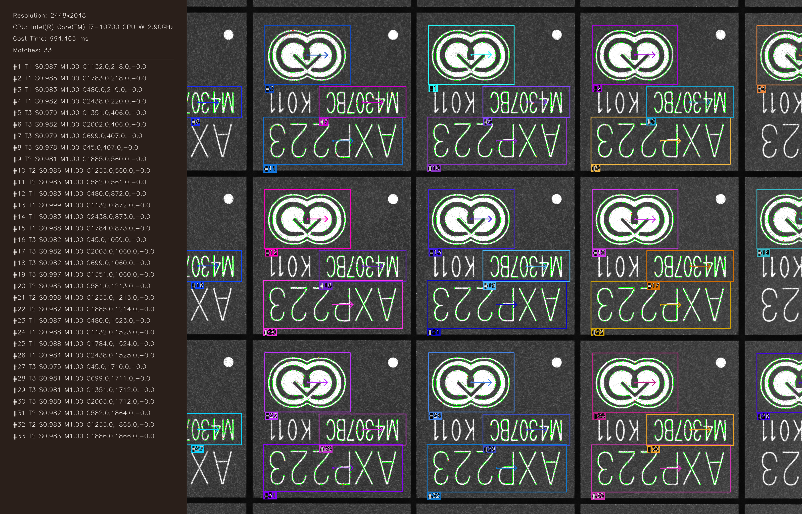
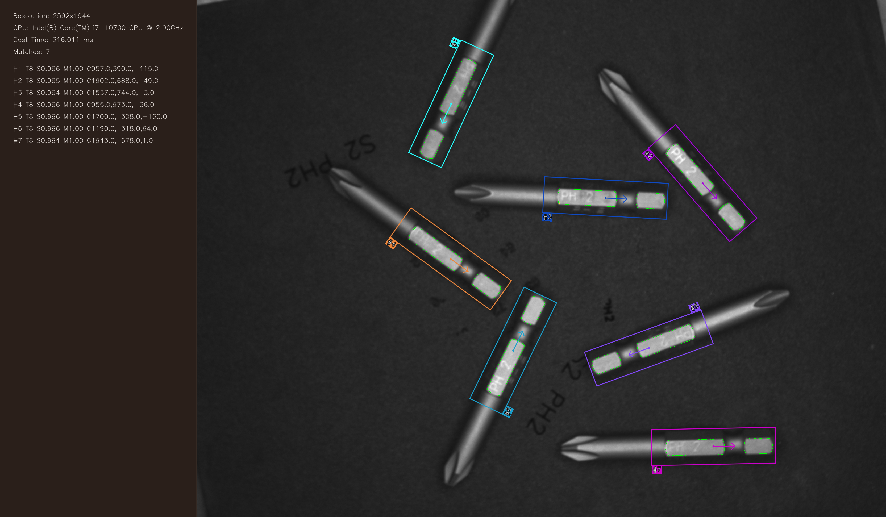
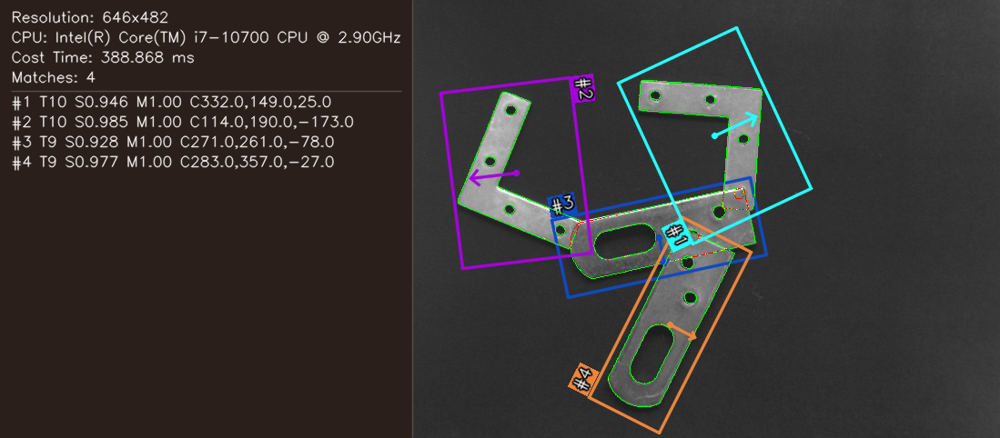
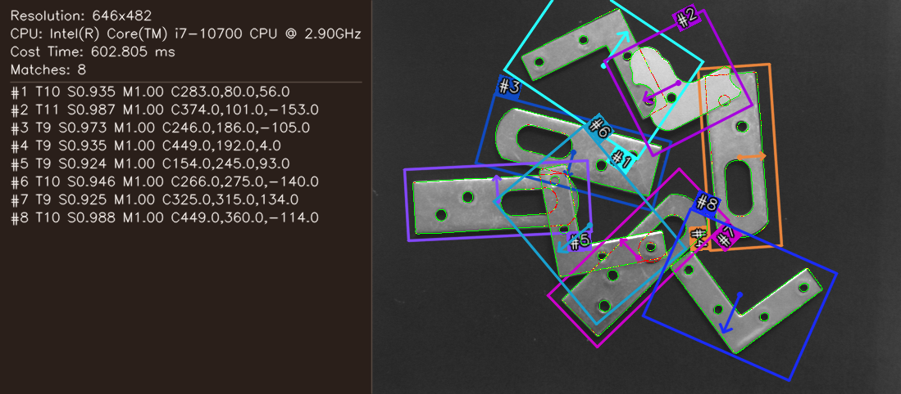
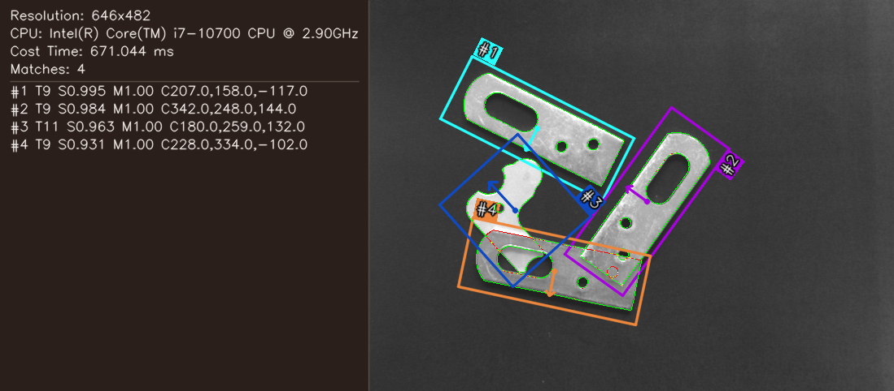

# 边缘形状模板制作与匹配原理

## 效果展示与核心数学公式

### 1. 算法效果直观展示

算法基于边缘梯度方向的归一化余弦相似度，具备高精度的旋转不变性、尺度适应性、部分遮挡容忍度与抗光照变化能力。以下展示在典型工业复杂场景下的定位效果：

| 多模板并发匹配（`result_src1_2_3.png`） | 边界截断与部分可见（`result_src8.png`） |
| :---: | :---: |
|  |  |
| **多模板并发搜索：同时检出 3 类工件（共计 33 个目标）** | **边界截断目标：部分轮廓超出图像边界仍可高精度定位（7 个目标）** |

| 局部极性反转（`result_src9_1.png`） | 密集排布多姿态（`result_src9_2.png`） | 弱对比度杂乱背景（`result_src9_6.png`） |
| :---: | :---: | :---: |
|  |  |  |
| **`src9_1`：边缘明暗反转与局部阴影干扰** | **`src9_2`：多角度旋转、高密度相邻工件区分** | **`src9_6`：弱纹理低对比度与杂乱背景噪声** |

### 2. 核心数学原理与公式推导

算法核心借鉴 Steger 边缘方向匹配理论，基于单位梯度向量的点积（即方向夹角的余弦值）度量模板与待测图的几何相似度。

#### (1) 整体余弦相似度度量（Global Cosine Similarity）

衡量模板变换后轮廓点集 $T$ 与待测图像局部点集 $S$ 之间的整体几何方向吻合度：


$$
\text{Similarity} = \cos(\theta_i) = \frac{\sum_{i=1}^n (T_i \cdot S_i)}{\sqrt{\sum_{i=1}^n \|T_i\|^2} \cdot \sqrt{\sum_{i=1}^n \|S_i\|^2}}
$$


- **物理意义**：
  - 分子 $\sum (T_i \cdot S_i)$ 累计各采样点处的梯度方向一致性；
  - 分母对模板与待测图的梯度模长进行联合归一化，使得最终相似度严格有界在 $[-1, 1]$ 之间；
  - 当且仅当所有特征点的梯度方向完全同向时，得分达到最大值 $1.0$。

#### (2) 特征点单位梯度向量归一化（Normalized Gradient Vectors）

在实际工程实现中，为消除对比度强弱（如反光、阴影、曝光差异）对匹配得分的非线性影响，将模板和待测图各点的梯度向量预先归一化为单位向量：


$$
\hat{T}_i = \frac{T_i}{\|T_i\|} = \left[ \frac{T_{i,x}}{\sqrt{T_{i,x}^2 + T_{i,y}^2}}, \frac{T_{i,y}}{\sqrt{T_{i,x}^2 + T_{i,y}^2}} \right], \quad \hat{S}_i = \frac{S_i}{\|S_i\|} = \left[ \frac{S_{i,x}}{\sqrt{S_{i,x}^2 + S_{i,y}^2}}, \frac{S_{i,y}}{\sqrt{S_{i,x}^2 + S_{i,y}^2}} \right]
$$


- **物理意义**：
  - 提取纯粹的“几何方向角信息”，使形状匹配对非线性光照与对比度波动具备高度鲁棒性；
  - 待测图像中低于 `min_contrast` 阈值的弱纹理/噪声点置为零向量，防止噪点产生虚假关联。

#### (3) 单点方向余弦 / 点积展开（Point-wise Dot Product Expansion）

每个特征点之间的方向余弦值即可直接通过正交方向分量的内积计算：


$$
\cos(\theta_i) = \hat{T}_i \cdot \hat{S}_i = \left( \frac{T_{i,x}}{\sqrt{T_{i,x}^2 + T_{i,y}^2}} \cdot \frac{S_{i,x}}{\sqrt{S_{i,x}^2 + S_{i,y}^2}} \right) + \left( \frac{T_{i,y}}{\sqrt{T_{i,x}^2 + T_{i,y}^2}} \cdot \frac{S_{i,y}}{\sqrt{S_{i,x}^2 + S_{i,y}^2}} \right)
$$


- **向量化与工程实现**：
  - 匹配得分计算的核心循环 `gt · gi` 直接分解为 $x$ 方向分量相乘与 $y$ 方向分量相乘后求和；
  - 该正交展开形式天然适配 SIMD 指令集（如 AVX2 256 位寄存器一次并行计算 8 对特征点），大幅提升粗到精金字塔搜索的遍历性能。

---

## 1. 目标与坐标约定

算法使用模板轮廓点的归一化梯度方向与待测图梯度方向之间的余弦相似度进行匹配。模板点以模板中心为原点，图像坐标为 `x` 向右、`y` 向下；输出位姿为目标中心 `(x, y)`、旋转角 `angle` 和尺度 `scale`。未启用尺度搜索时 `scale = 1`。

二维旋转矩阵采用图像坐标约定。设公开位姿角为 `θ`，模板中心坐标为
`p=(x,y)^T`，则运行时坐标变换为：

```text
R(θ) = [ cosθ   sinθ ]
       [-sinθ   cosθ ]
p' = R(θ) p + (x0, y0)^T
```

其中 `(x0,y0)` 是待测图中的候选中心；梯度方向向量使用同一个 `R(θ)` 旋转，
因此平移不影响方向余弦。

## 2. 模板制作

1. 校验模板、掩模、金字塔层数、角度范围、角度步长和对比度阈值。模板与掩模必须非空、尺寸相同且为 8 位图像。
2. 将彩色输入转为灰度图。掩模的非零区域是有效训练区域。
3. 逐层构建高斯金字塔，在每层用 Canny/梯度计算提取候选边缘点。
4. 将特征坐标从左上角原点转换到模板中心原点，并保存梯度方向分量。
5. 每层只保存一份 `0°` canonical 特征及其外包围矩形。

训练阶段不保存每个角度的重复点集。这样模型体积与训练内存复杂度从近似
`O(L·A·F)` 降为 `O(L·F)`，其中 `L` 为金字塔层数、`A` 为角度数、`F` 为每层特征数。

## 3. 角度的运行时展开

加载模型后，根据模型中的 `angle_start`、`angle_end` 和 `angle_step`，由 canonical 点确定性生成搜索角度：

```text
pθ = R(θ) p0
gθ = R(θ) g0
```

其中 `p` 为中心相对坐标，`g` 为梯度向量，`R` 为二维旋转矩阵。各金字塔层可使用更粗的角度步长，精匹配层再细化。展开只执行一次并缓存；不得在每次候选打分时重复生成。JSON 继续采用“每层仅 0°”格式；加载器也应兼容历史二进制模型中已经包含多个角度的情况，避免二次旋转补齐。

## 4. 粗到精匹配

待测图建立同层数梯度金字塔。最高层以较大的位置和角度步长扫描。设几何可见点数为 `V`，搜索梯度达到 `min_contrast` 的点数为 `M`，默认有符号极性得分为：

```text
score_use = max(0, Σ (gt · gi) / V)
visible_ratio = V / Ntemplate
matched_ratio = M / V
```

这里 `gt` 和 `gi` 均为单位梯度向量，故 `gt·gi=cos(Δφ)`，数值先限制在
`[-1,1]`。忽略全局极性时使用：

```text
score_global = |Σ (gt · gi)| / V
```

忽略局部极性时使用：

```text
score_local = Σ |gt · gi| / V
```

启用亚像素精修后，离散采样点 `θ-δ, θ, θ+δ` 的得分可用二次曲线
`q(t)=at²+bt+c` 拟合，顶点为 `t*=-b/(2a)`，并限制在 `[-δ,δ]`；位置和
尺度精修使用同样的有界三点插值。这样输出角度、位置和尺度不再被离散步长限制。

弱梯度点仍计入 `V` 但贡献为 0，防止只剩少量强边缘时得分虚高。全局忽略极性使用 `|Σ dot|/V`，只允许整个候选统一反色；局部忽略极性使用 `Σ|dot|/V`。三种度量的点积都夹在 `[-1,1]`。

候选超过当前层传播门限后向下一层传播，在局部位置和角度邻域细化。用户给定的
`min_score` 是 L0 最终验收门限；中间金字塔层使用
`max(0.4, min_score-0.2)`。降采样会引入量化和模糊，中间层若直接使用最终门限，
可能在目标到达原图复评前造成不可恢复的漏检。

粗层的同一空间峰保留有限个角度模态，并要求相邻模态具有足够角度间隔。遮挡可能
令错误的 180° 假设在粗层暂时领先，只保留一个方向会使正确姿态无法到达 L0；不
限制模态数量又会显著增加精匹配耗时。逐层精化的角度半径按上一层采样步长加一个
两度量化余量计算，而不是固定为 4°，确保候选能从粗量化角度收敛到原图上的真实
方向。

逐层细化采用有效性传播：只有当前金字塔层确实找到有效评分结果，候选才会进入下一层。失败层不得复用上一层的位姿或分数，也不得再次叠加旧裁剪偏移；这避免了弱候选产生图像范围外的伪结果。

`greediness` 用于提前终止明显不可能达标的候选；值越高通常剪枝越激进。启发式早停只用于分母已知的完整、无掩模候选；部分可见和带孔掩模的候选必须完整计分。此外，完整候选使用“当前和 + 剩余点最大可能贡献”的严格上界做无损剪枝。

`max_overlap` 对应轮廓特征支撑带的 IoU 门限。NMS 将最接近候选角度的 L0
特征按候选位置和尺度变换，每个特征扩张为半径 2 的菱形像素带，再以两个有序
像素集合的交并比判断是否是同一轮廓。这样重叠外接框内的不同工件仍可同时保留。
同模板且任一分数低于 0.9 时，旋转外接框按较小框面积归一化的重叠率仍作为弱峰
去重兜底。跨模板不使用外接框抑制；但若两个中心的距离不超过两模板缩放后较小边
的 20%，则认为低分项是近中心重复。该窄门限用于处理不同模板在同一工件上命中
不同局部边缘、导致支撑 IoU 偏低的情况。

最终候选可选在离散角度的左、中、右得分上做抛物线插值，然后在精修角度下对 `x/y` 邻域做同类插值。多尺度搜索会为 NMS 后候选关联相邻尺度上的同一空间峰，在三个离散得分上对 `scale` 做有界二次插值。精修仅作用于 NMS 后的少量候选，避免将双线性采样放入全图穷举内循环。

## 5. 部分可见目标

目标中心可位于图像边缘附近。打分时逐点检查变换后的坐标，只累计图像内、搜索掩模内的点，图像外点不访问内存，也不计入分母。使用 `Nvalid` 而不是模板总点数归一化，并要求：

- `Nvalid / Ntemplate >= min_visible_ratio`。

该门槛避免极少数偶然同向边缘产生高分。绘制时所有轮廓线和矩形边均裁剪到图像范围，超出部分不绘制。

## 6. 多尺度搜索

尺度范围由 `scale_min`、`scale_max`、`scale_step` 描述，例如 `[0.8, 1.2]`。当前实现对待测图按 `1/scale` 反向缩放，复用同尺度金字塔内核，再将结果坐标映射回原图。这与对 canonical 点应用下式等价：

```text
p(θ,s) = R(θ) · (s p0)
```

梯度方向只旋转，不随均匀尺度改变。每个离散尺度都执行完整的粗到精匹配。结果携带最终 `scale`，绘制和重叠抑制也使用缩放后的尺寸。

尺度参数约束为 `0 < scale_min <= scale_max` 且 `scale_step > 0`。尺度样本数约为 `S = floor((scale_max-scale_min)/scale_step)+1`，朴素搜索复杂度为 `O(P·A·S·F)`；应通过金字塔、候选传播、提前终止和变换特征缓存控制开销。

## 7. 多模板匹配

每个模板具有稳定的 `template_id`、独立配置、canonical 金字塔和运行时展开缓存。多模板搜索先裁切一次 ROI，并为每个搜索尺度只缩放一次图像和用户掩模；随后各模板复用这些只读尺度输入执行自身的 padding、金字塔、匹配及跨尺度 NMS。模型相关的 padding 不共享，以保持各层下采样网格和单模板结果完全一致。结果记录 `template_id`、位姿、尺度与分数。

抑制分两级进行：先在同一模板内去重，再对合并结果执行支撑带 IoU 去重。不同模板
允许外接框大面积相交；只有支撑带 IoU 超阈值或中心极近时才抑制较低分候选。
不同模板的阈值、角度范围和尺度范围可以独立配置。

## 8. 可视化

每个结果绘制经尺度和旋转变换后的可见轮廓与外包围矩形，并标注：

```text
#<index> T<template_id> S=<score> Scale=<scale>
```

待测图内只绘制 `#<index>` 小标签。以模板正 `x` 轴的角度箭头为起点，沿屏幕坐标
顺时针旋转 135° 后投射到旋转包围框，选择投影最大的角；标签贴在该角外侧并与
相邻长边平行，必要时将文字方向翻转 180° 以保持正向可读。标签使用与外包围框
一致的彩色底纹及白色描边文字，并在图像边缘安全裁剪。

推理程序在待测图左侧扩展纯色信息栏，先绘制 `Time` 和 `Matches`，再逐行绘制
`#<index> T<template_id> S<score> M<scale> C<x>,<y>,<angle>`。面板宽度取决于最宽
文本；行数超过单列容量时横向增加列，保持原始待测图高度不变。字体、内边距和
行距随图像短边缩放。外包围框调色板明确排除红色和绿色，以免与逐点质量颜色
混淆；模板金字塔的 canonical 特征固定使用绿色。

## 9. 建议验收项

- 同一模型重复制作不会累积金字塔或角度数据。
- 非法角度步长、空图、空掩模、尺寸不一致和非法尺度参数均返回失败。
- JSON canonical 模型和历史多角度二进制模型均能加载。
- `scale=1` 时与原单尺度结果在允许误差内一致；0.8、1.0、1.2 倍目标均可检出。
- 图像四边和四角的部分目标在可见率达标时可检出，绘制无越界异常。
- 两个以上模板可在同图中返回正确 `template_id`，且排序、索引和得分显示稳定。
- 外接框重叠但轮廓支撑分离的目标均被保留；同支撑重复候选和跨模板近中心重复只保留最高分项。
- 全图反色时 global/local polarity 可命中而 use polarity 拒绝；局部反色时只有 local polarity 通过高阈值。
- 提高 `min_contrast` 会降低 `matched_ratio` 和弱边缘候选得分，但不改变几何 `visible_ratio`。
- 非整数角度目标开启精修后返回非整数角度，且误差应显著小于离散搜索。
- 离散尺度峰两侧都有同一目标候选时，尺度插值应返回非步长整数倍，且比离散峰更接近合成真值。
